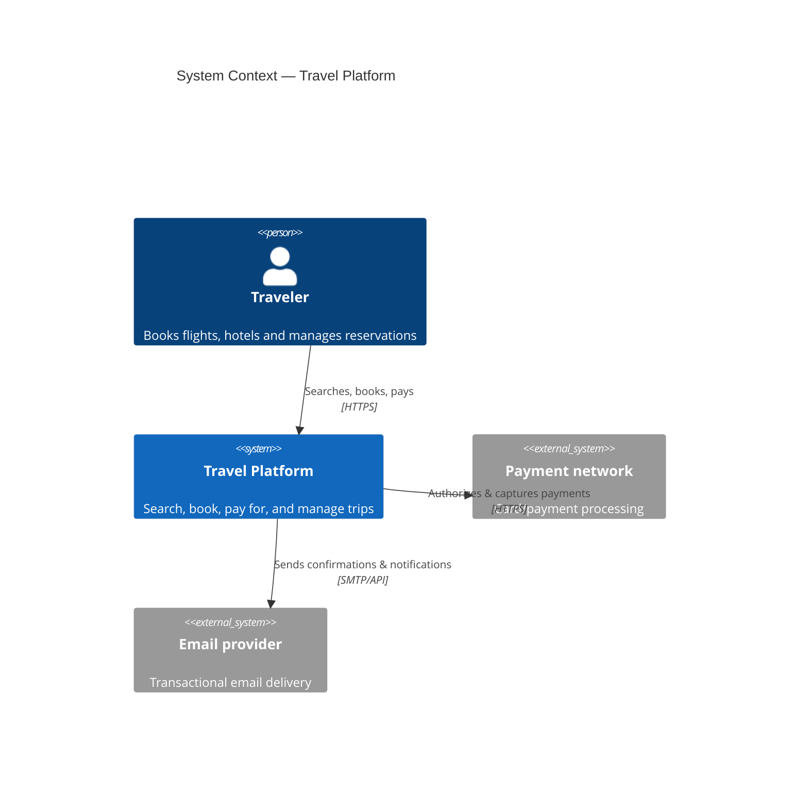

# Travel Platform

Enterprise-grade travel booking platform (flights, hotels, payments, loyalty)
built as a set of independently deployable microservices, following the same
engineering practices used in production systems at scale: domain-driven
design, event-driven communication, infrastructure as code, full observability,
and a CI/CD pipeline with real quality gates.

This is not a CRUD demo. It is an exercise in building a system the way a
production team would: every dependency, service boundary, and infrastructure
choice is documented and justified in [docs/adr](docs/adr).

> **Status:** early development — see [ROADMAP.md](ROADMAP.md) for what is
> built versus planned. The repository is public from the first commit so
> that its evolution is visible.

## Why this exists

Most portfolio projects use a handful of technologies to show familiarity
with them. This one is built around a different question: _does the system
survive contact with reality?_ Can it be debugged from a log line, scaled
under load, recovered from a dependency outage, and understood by someone who
did not write it? The engineering practices below exist to answer "yes."

## Architecture at a glance



See [docs/c4](docs/c4) for the full context and container diagrams, and
[ARCHITECTURE.md](ARCHITECTURE.md) for the reasoning behind the service
boundaries.

## Tech stack

| Layer          | Choices                                                                            |
| -------------- | ---------------------------------------------------------------------------------- |
| Backend        | Java 25, Quarkus 3, RESTEasy Reactive, Hibernate Validator, MapStruct              |
| Frontend       | React, TypeScript, Vite, TanStack Query, React Hook Form, Zod, Tailwind, shadcn/ui |
| Data           | MongoDB (primary), Redis (cache/session/rate-limit), OpenSearch (search)           |
| Messaging      | Apache Kafka (consumer groups, retry topics, DLQ)                                  |
| Cloud (local)  | LocalStack (S3, SQS, SNS, SES, Secrets Manager, EventBridge)                       |
| Infrastructure | Docker Compose, Terraform, Kubernetes manifests                                    |
| Observability  | OpenTelemetry, Prometheus, Grafana, Loki, Tempo                                    |
| Quality        | JUnit 5, Testcontainers, ArchUnit, PIT (mutation), k6/Gatling, JaCoCo, SonarQube   |

Every choice above has a corresponding ADR in [docs/adr](docs/adr) explaining
why it was picked over the alternatives.

## Repository layout

```
travel-platform/
├── backend/            # One directory per microservice (Quarkus)
├── frontend/           # React application
├── infrastructure/     # Docker, Terraform, Kafka, monitoring, scripts
├── docs/               # ADRs, C4 diagrams, API/AsyncAPI specs, runbooks
├── ai/                 # Engineering assistants (see docs/context)
└── .github/            # Templates, CODEOWNERS, CI workflows
```

## Getting started

Requirements: Docker, Docker Compose, `make`.

```bash
make setup   # copy .env.example -> .env, install git hooks
make up      # start MongoDB, Redis, Kafka, LocalStack
make ps      # check container status
```

Individual services will document their own run instructions in
`backend/<service>/README.md` as they are built.

## Documentation

- [ARCHITECTURE.md](ARCHITECTURE.md) — service boundaries and system design
- [ENGINEERING.md](ENGINEERING.md) — how development happens day to day
- [docs/adr](docs/adr) — Architecture Decision Records
- [docs/runbooks](docs/runbooks) — operational playbooks
- [CONTRIBUTING.md](CONTRIBUTING.md) — branching model, commit conventions
- [SECURITY.md](SECURITY.md) — vulnerability reporting, secret-handling rules
- [ROADMAP.md](ROADMAP.md) — public milestone plan

## License

[MIT](LICENSE)
