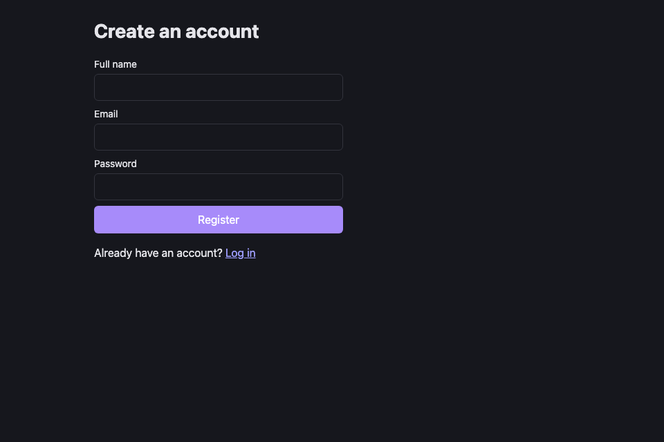
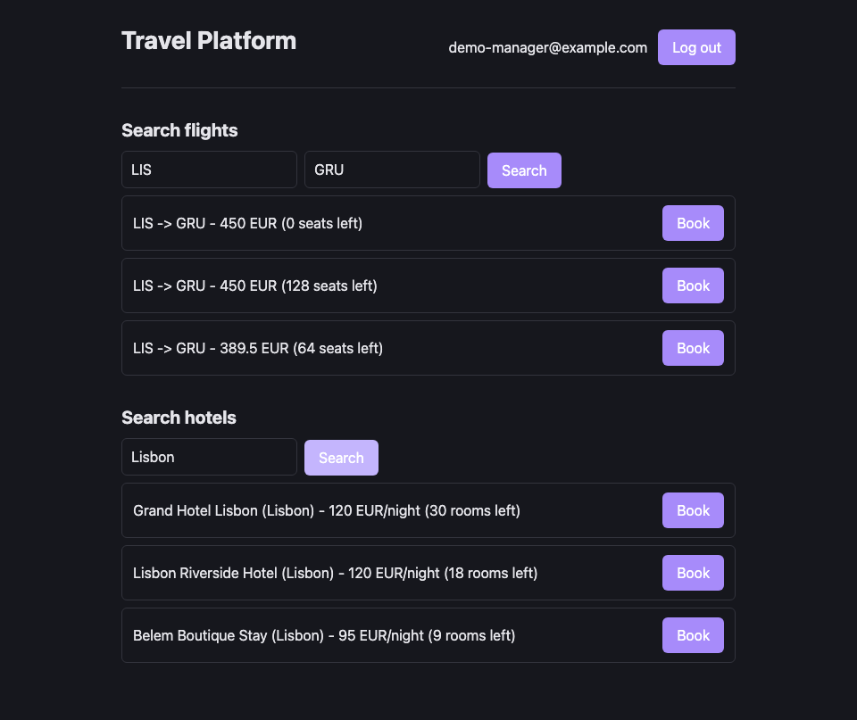
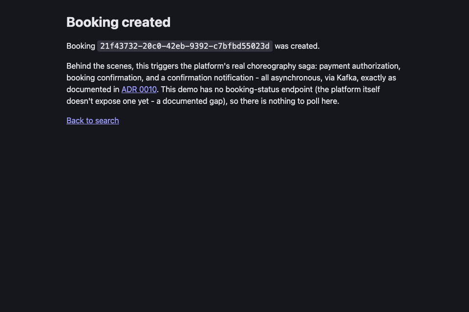
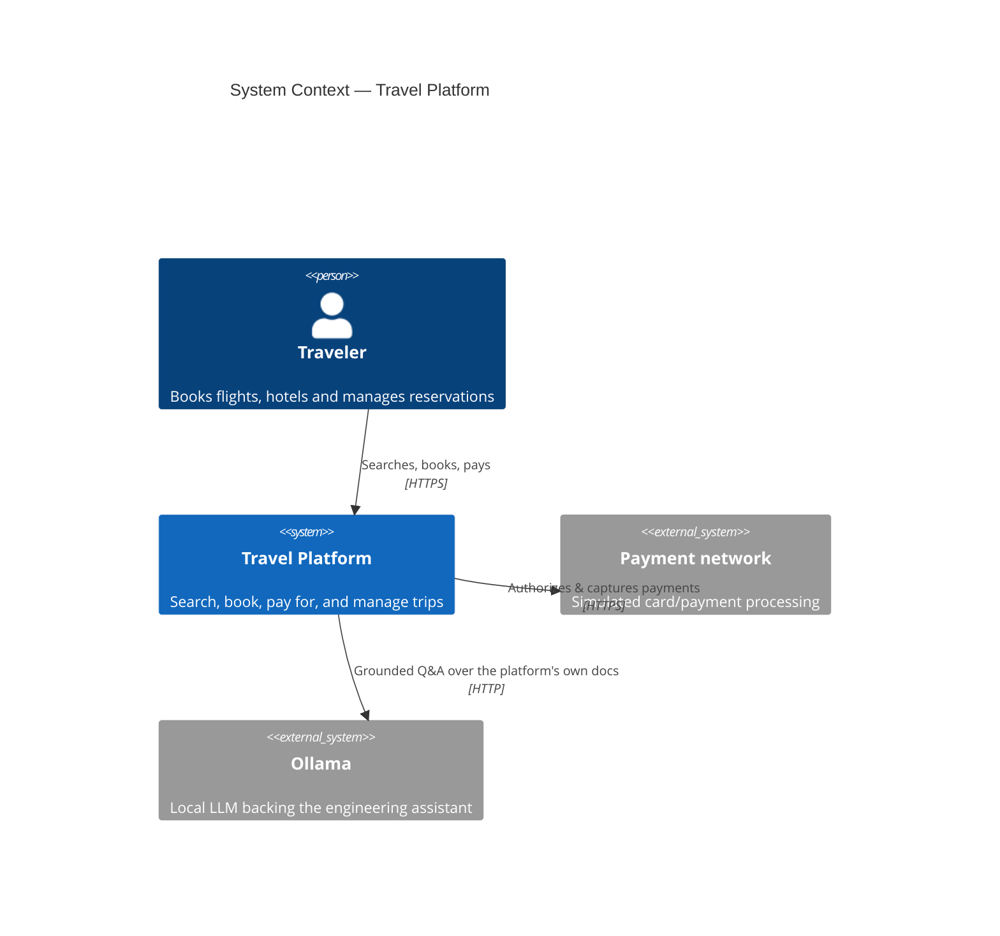

# Travel Platform

Enterprise-grade travel booking platform (flights, hotels, bookings,
payments, notifications) built as nine independently deployable
microservices, following the same engineering practices used in production
systems at scale: domain-driven design, event-driven communication,
infrastructure as code, full observability, and a CI/CD pipeline with real
quality gates.

This is not a CRUD demo. It is an exercise in building a system the way a
production team would: every dependency, service boundary, and
infrastructure choice is documented and justified in [docs/adr](docs/adr) -
19 ADRs, every one written against what was actually built and measured,
not projected.

> **Status:** feature-complete through all six planned phases - see
> [ROADMAP.md](ROADMAP.md) for the full milestone history. All 20
> milestones shipped; nothing here is aspirational.

## Live demo

**Frontend:** https://aerostay-jeferson0306s-projects.vercel.app

**Live system status:** https://aerostay-jeferson0306s-projects.vercel.app/status

- every service's own health endpoint, polled directly from your browser,
  not a cached badge.

<!-- Backend deployment pending - see docs/adr/0019-public-demo-deployment.md
     for the essential-flow scope and why the full stack (Kafka, OpenSearch,
     Ollama included) isn't what's exposed publicly, and its addendum for
     the Railway -> Render hosting change. -->

Backend hosting is moving from Railway to Render (Railway's trial expired);
the essential-flow services (identity, flight, hotel, booking, gateway)
aren't public yet. Everything runs locally with one command (`make
apps-up`) and was verified end-to-end against the real running stack,
screenshots included - the `/status` page above is built to work against
either.

See
[docs/runbooks/public-demo-verification.md](docs/runbooks/public-demo-verification.md)
for the full list of public URLs (frontend, gateway, per-service Swagger)
and how to test the golden path once they're live.

## Screenshots

Real screenshots from a local run against seeded data - not mockups.

|                                                                    |                                                        |
| ------------------------------------------------------------------ | ------------------------------------------------------ |
|                          |  |
| Register                                                           | Search flights & hotels, real inventory                |
|  |                                                        |
| Booking created - triggers the real choreography saga              |                                                        |

## Why this exists

Most portfolio projects use a handful of technologies to show familiarity
with them. This one is built around a different question: _does the system
survive contact with reality?_ Can it be debugged from a log line, scaled
under load, recovered from a dependency outage, and understood by someone
who did not write it? Every milestone from M15 onward answered that
question by actually breaking something on purpose and documenting what
happened - a Toxiproxy chaos experiment against the circuit breaker
(ADR 0015), a resource-constrained Kubernetes deployment that surfaced
three genuine Kubernetes-specific bugs (ADR 0016), an LLM that hallucinated
until its context window was fixed (ADR 0018).

## Architecture at a glance



Nine backend services sit behind a single API gateway, communicating with
each other exclusively via Kafka events - there is no synchronous
service-to-service REST call anywhere in the platform (audited in
ADR 0014). See [docs/c4](docs/c4) for the full context and container
diagrams, [ARCHITECTURE.md](ARCHITECTURE.md) for the reasoning behind the
service boundaries, and [docs/context/platform-overview.md](docs/context/platform-overview.md)
for a one-page factual map (also what the engineering assistant is
grounded in).

## Services

| Service                | Port | Owns                                                |
| ---------------------- | ---- | --------------------------------------------------- |
| `gateway`              | 8080 | Routing, JWT fast-fail, rate limiting               |
| `identity-service`     | 8081 | Users, RS256 JWT issuance                           |
| `booking-service`      | 8082 | Reservation lifecycle, saga orchestration           |
| `flight-service`       | 8083 | Flight inventory                                    |
| `hotel-service`        | 8084 | Hotel inventory                                     |
| `payment-service`      | 8085 | Simulated payment authorization/refund              |
| `notification-service` | 8086 | Booking confirmation email (simulated)              |
| `search-service`       | 8087 | Flight/hotel search & autocomplete (OpenSearch)     |
| `assistant-service`    | 8088 | Engineering Q&A grounded in `docs/context` (Ollama) |

## Tech stack

| Layer          | Choices                                                                |
| -------------- | ---------------------------------------------------------------------- |
| Backend        | Java 25, Quarkus 3, RESTEasy Reactive, Hibernate Validator             |
| Frontend       | React 19, TypeScript, Vite, React Router                               |
| Data           | MongoDB (per-service), Redis (rate limits), OpenSearch (search)        |
| Messaging      | Apache Kafka (consumer groups, retry queues, DLQ per group)            |
| AI             | Ollama (local LLM, no paid API - ADR 0018)                             |
| Cloud (local)  | LocalStack (S3), Terraform                                             |
| Infrastructure | Docker Compose, Kubernetes manifests (Kustomize), Render, Vercel       |
| Observability  | Structured JSON logs, OpenTelemetry trace/span IDs, Prometheus metrics |
| Quality        | JUnit 5, Testcontainers, ArchUnit, k6, Toxiproxy, JaCoCo               |

Every choice above has a corresponding ADR in [docs/adr](docs/adr)
explaining why it was picked over the alternatives - and, for most of
them, what was actually measured once built.

## Repository layout

```
travel-platform/
├── backend/            # Nine microservices (Quarkus) + shared parent POM
├── frontend/           # React application (register, search, book)
├── infrastructure/     # Docker Compose, Kubernetes, Terraform, Kafka
├── docs/                # ADRs, C4 diagrams, runbooks, context/prompts for AI agents
├── testing/            # k6 load scripts, Toxiproxy chaos scenario
└── .github/            # Templates, CODEOWNERS, CI workflow
```

## Getting started

Requirements: Docker, Docker Compose, Maven, `make`.

```bash
make apps-build   # package all nine services
make apps-up      # full stack: infra + all nine services
make apps-ps      # check container status
```

The gateway is then reachable at `http://localhost:8080`. See
`frontend/README.md` to run the companion UI against it, and
[docs/runbooks](docs/runbooks) for load/chaos-test results and the
Kubernetes deployment log.

## Documentation

- [ARCHITECTURE.md](ARCHITECTURE.md) - service boundaries and system design
- [AGENTS.md](AGENTS.md) - entry point for AI agents working on this repo
- [docs/context](docs/context) - curated platform facts (services, events, conventions)
- [docs/adr](docs/adr) - 19 Architecture Decision Records
- [docs/runbooks](docs/runbooks) - real load-test, chaos-test and deployment results
- [CONTRIBUTING.md](CONTRIBUTING.md) - branching model, commit conventions
- [SECURITY.md](SECURITY.md) - vulnerability reporting, secret-handling rules
- [ROADMAP.md](ROADMAP.md) - full milestone history (all 20 shipped)

## License

[MIT](LICENSE)
