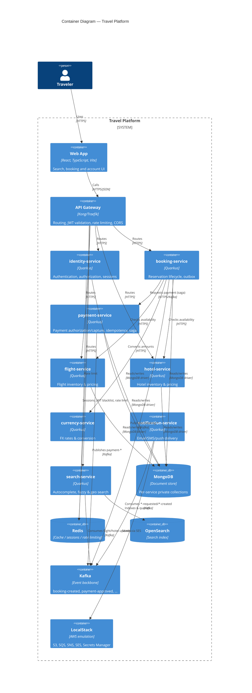

# C4 — Level 2: Containers

## Notes

- No service reads another service's MongoDB collections directly — all
  cross-service data access is via REST API or Kafka event.
- `gateway` is the only container reachable from outside the platform
  boundary besides the SPA build artifacts themselves.
- This diagram reflects the target shape. Containers are implemented
  incrementally per [ROADMAP.md](../../ROADMAP.md); until a service exists,
  it is documented here as planned, not as running.
