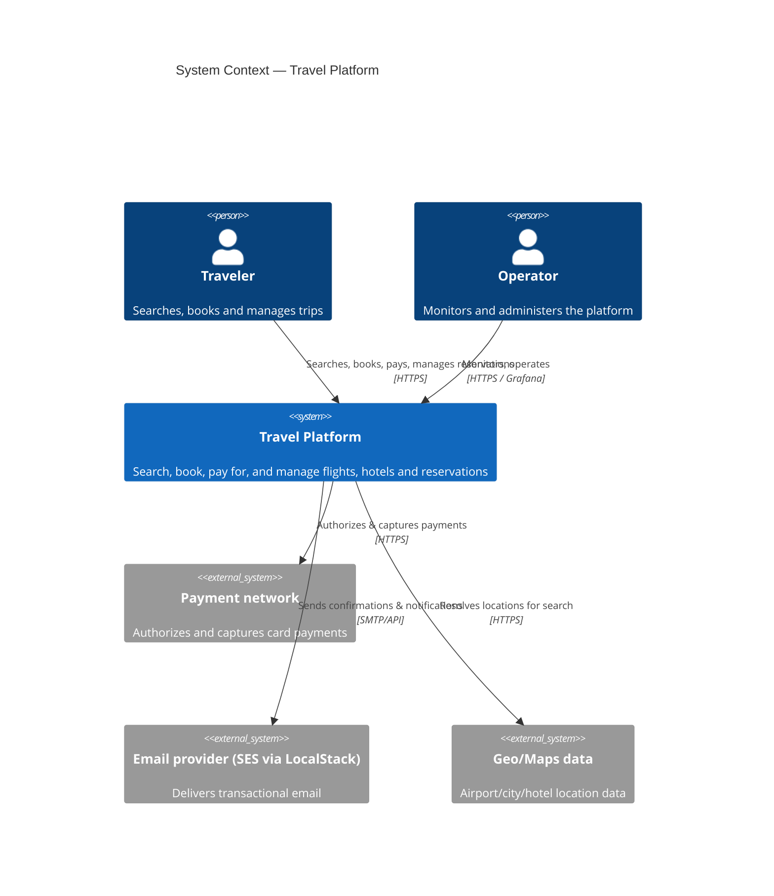

# C4 — Level 1: System Context

## Actors

- **Traveler** — the end user of the platform: searches inventory, books,
  pays, manages their reservations and loyalty status.
- **Operator** — internal user who monitors system health and operates the
  platform (dashboards, incident response).

## External systems

- **Payment network** — simulated locally; production integration point for
  a real payment processor.
- **Email provider** — SES, emulated locally through LocalStack.
- **Geo/Maps data** — reference data source for airports, cities, hotel
  locations, used by `search-service`.

See [container.md](container.md) for the next level of detail (services
inside the platform boundary).
